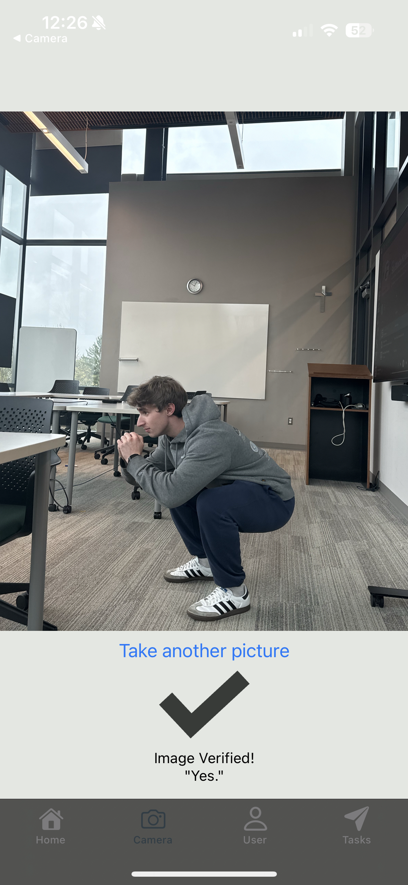
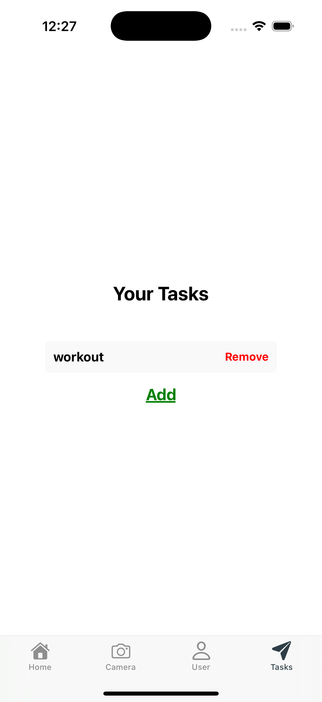

# Snap Motive - HackHounds 2025
🏆 Computer Vision Track 🏆
 
A gamified goal-tracking app that motivates you to achieve your daily targets by capturing a photo of you in action!

## Screenshots
| Working out with camera verification | Group motivation page | Adding task page |
|:-----------------------------------------:|:---------------------:|:----------------:|
|  |  |  |

## Inspiration

One of the best ways to motivate yourself is by gamifying your daily routine. Inspired by Snapchat’s streaks, we wanted to create a system where you set a daily goal and capture a photo of yourself achieving it.

## What It Does

Snap Motive lets you and your friends:
- **Set Daily Goals:** Create shared or individual goals.
- **Track Progress:** Easily monitor your progress over time.
- **Verify Achievements:** Capture a photo as proof of completing your goal—whether it’s performing an activity or being in a designated location.
